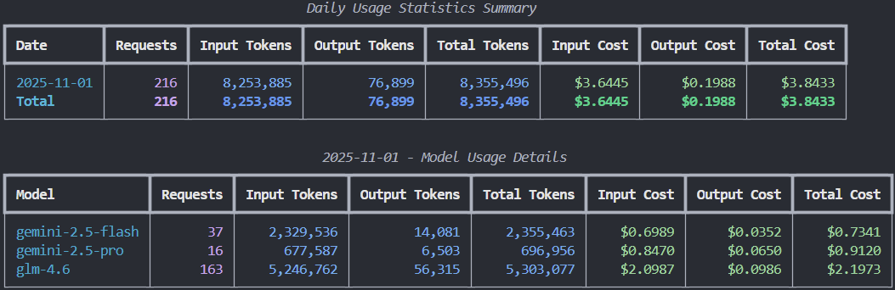

# SexyToken



Have you ever watched your code run elegantly late at night, yet felt a lingering unease?

That invisible torrent of Tokens, like a mysterious lover, you crave its power but fear its unpredictability. Every API call feels like a heart-racing whisper - you get a response, but don't know the cost.

This loss of control is the creator's greatest demon.

**And SexyToken is the light that pierces through this fog.**

It lets you "touch" the pulse of costs for the first time, tracing the curves of data flow with your fingertips, feeling the warmth of every computation. It transforms cold numbers into a flowing, colorful tapestry - clear, direct, with breathtaking beauty.

It frees you from the fear of the unknown, turning anxious guesses into confident composure.

When every creation is accompanied by absolute clarity and control; when every line of code radiates the confidence of complete understanding...

**Isn't this feeling "sexy"?**

**SexyToken, dedicated to every creator who pursues ultimate control and elegance.**

---

## Features

- Get usage statistics from CLIProxyAPI
- Daily token usage and cost statistics
- Support token pricing configuration for different models
- Generate beautiful table output using rich library
- Support displaying overall overview and detailed model usage

## Installation

```bash
pip install -r requirements.txt
```

## Usage

#### Basic Usage

```bash
python src/usage_report.py
```

#### Specify Service URL and Management Key

```bash
python src/usage_report.py --url http://localhost:8317 --key your_management_key
```

#### Show Detailed Model Usage

```bash
python src/usage_report.py --details
```

#### Show Summary Only (without model details)

```bash
python src/usage_report.py --total
```

#### Set Management Key Using Environment Variable

```bash
export CLI_PROXY_MANAGEMENT_KEY=your_management_key
python src/usage_report.py
```

## Command Line Arguments

- `--url`: CLIProxyAPI service URL (default: http://localhost:8317)
- `--key`: Management API key (can also be set via CLI_PROXY_MANAGEMENT_KEY environment variable)
- `--config`: Token pricing configuration file path (default: conf/token_pricing.json)
- `--details`: Show detailed usage for each model per day
- `--total`: Show summary information only, without model details

## Configuration File

The token pricing configuration file `token_pricing.json` contains the following structure:

```json
{
  "pricing": {
    "default": {
      "input_token_per_million": 1.0,
      "output_token_per_million": 7.5
    }
  },
  "models": {
    "gemini-2.5-pro": {
      "input_token_per_million": 1.25,
      "output_token_per_million": 10.00
    }
  }
}
```

- `pricing.default`: Default token pricing (used when model doesn't have specific pricing)
- `models`: Specific pricing configuration for each model

## Output Example

The script generates the following output:

1. **Overall Overview**: Shows total requests, successful/failed requests, total tokens, etc.
2. **Daily Summary Table**: Shows usage statistics and cost summary for each day
3. **Detailed Model Information** (optional): Shows detailed usage for each model per day

## Notes

- Ensure CLIProxyAPI service is running and management API is enabled
- A valid management key is required to access usage statistics
- Usage statistics are only stored in memory and will be cleared after service restart

---

## GLM Log Analysis Integration

SexyToken not only supports getting usage statistics from CLIProxyAPI but also supports analyzing GLM model log files, providing more comprehensive token usage analysis.

### Features

- **Automatic Log Parsing**: Automatically parse GLM model token usage log files
- **Multi-source Data Integration**: Merge API statistics with log file data for combined analysis
- **Flexible Configuration**: Support custom log file directory paths
- **Detailed Statistics**: Provide detailed token usage statistics by date and model

### Configure GLM Log Directory

#### Method 1: Using Command Line Arguments

```bash
python src/usage_report.py --glm-log-dir /path/to/glm/logs
```

#### Method 2: Modify Configuration File

1. Copy the example configuration file:

```bash
cp conf/log_conf.example.py conf/log_conf.py
```

2. Edit `conf/log_conf.py` and modify the log directory path:

```python
# GLM Token log file directory path
GLM_LOG_DIRECTORY = "/path/to/your/glm/logs"
```

### Log File Format

GLM log files should follow the following format:

- File name format: `token_usage_YYYY-MM-DD.log`
- One JSON object per line, containing the following fields:
  ```json
  {
    "timestamp": "2023-11-01T10:30:00Z",
    "model": "glm-4.6",
    "token_usage": {
      "prompt_tokens": 100,
      "completion_tokens": 50,
      "total_tokens": 150
    }
  }
  ```

### Usage Examples

#### Analyze GLM Logs and Generate Reports

```bash
# Basic usage (using default log directory)
python src/usage_report.py

# Specify GLM log directory
python src/usage_report.py --glm-log-dir /path/to/glm/logs

# Show detailed model usage (including GLM models)
python src/usage_report.py --details

# Show summary only
python src/usage_report.py --total
```

### Output Description

When GLM log analysis is enabled, the report will include:

1. **Merged Statistics**: Merged statistics of API data and GLM log data
2. **GLM Model Details**: Detailed usage of each GLM model
3. **Cost Calculation**: Calculate GLM model usage costs based on configured pricing

### Notes

- Ensure GLM log file paths are correct and accessible
- Log files must meet the specified format requirements
- GLM log data will be merged with API data to avoid duplicate calculations
- If both API data and log data exist for the same date, the system will automatically merge and process them
